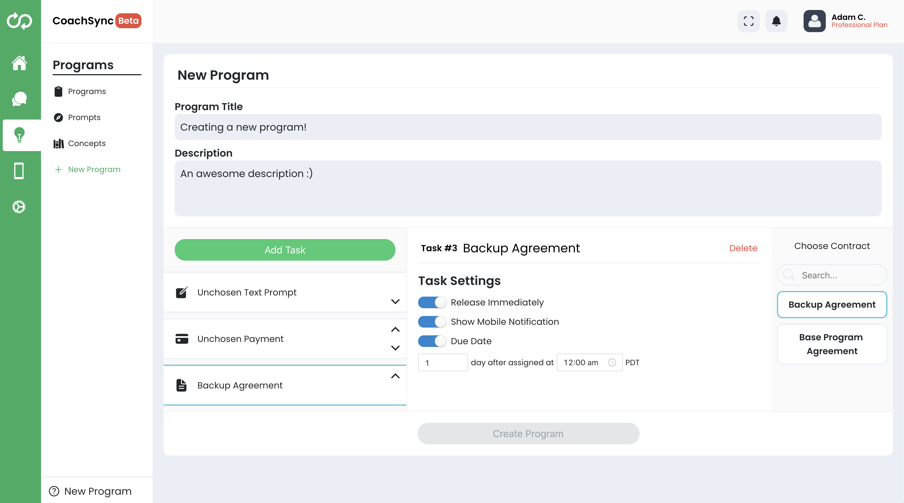

# CoachingDashboard (80% Complete)
CoachingDashboard with many features for coaches to leverage:

Not Done: Social Feed, Integrations, Account, Clients.

### Client Management

Assign tasks, create tags, take notes on clients, and more.

### Payments

Allows coach to view previous payments received from clients.

### Invite Clients

A variety of ways to invite clients. Will be expanded on later with custom-generated marketing materials.

### Feature Board

A way for the CoachSync community to engage with the developer and improve the product.

### Messaging

A messaging system that connects with the CoachSync app. Allows for custom message templates to simplify coach-client communication.

### Programs
 
Coaches can group prompts, concepts, and clients into easily managable programs to easily keep clients up to date and view summarized data.

### Prompts 
 
Tasks that clients interact with in some way to complete. Surveys, single responses, payments, and contracts can be administered by the coach.

### Concepts
 
Readable information put together by the coach, such as RichText, videos, or PDFs of knowledge for clients to learn from.

### Program Creation 
 
Quickly and easily design programs using prompts and concepts, customizing an automated experience for any future client added to the program.

### Mobile App

Allows the coach to customize the in-app experience for their clients to fit the coach's personal branding.

### Onboarding

Provides control over the onboarding experience for new clients who just downloaded the app or are taking the web-version of the onboarding experience.

### Manage Plan

Provides the ability to manage the coaches' platform subscription.